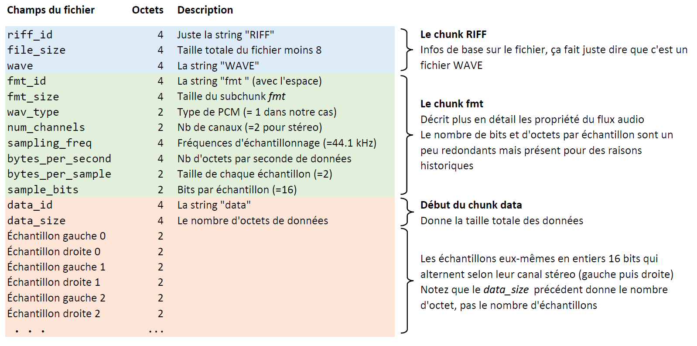

# Fichiers WAV (chapitre 8)

## Introduction

En audio numérique, la modulation d’impulsion codée (PCM en anglais) est une méthode utilisée pour représenter numériquement un signal analogique échantillonné. C’est ce qui est utilisé dans les ordinateurs, dans les CD audio et en téléphonie numérique. Dans un flux PCM, l’amplitude du signal analogique est enregistrée comme une valeur numérique à intervalles réguliers; c’est ce qu’on appelle l’échantillonnage. L’intervalle entre les échantillons est donné par la fréquence d’échantillonnage, qui est exprimée en Hz.

Un flux audio non compressé est donc composé d’une série d’échantillons de signal, et un fichier audio est typiquement composé d’un entête suivi d’un flux audio.

Pour plus d'info : [Échantillonnage PCM](https://fr.wikipedia.org/wiki/Modulation_d'impulsion_codée)

## Nouveau type : Tuples avec champs nommé

Parfois on veut quelque chose qui est à mi-chemin entre un tuple et un dictionnaire, c'est-à-dire une structure de donnée séquentielle simple, mais dont les éléments sont nommés.

On va alors utiliser `collections.namedtuple` qui agit exactement comme un tuple (avec l'accès par index, le déroulage avec `*`, etc.) mais dont les éléments sont accessibles avec un nom en plus de l'index.

```python
from collections import namedtuple

# On construit d'abord un nouveau type de tuple
# en lui donnant un nom et en nommant chacun des élément du tuple.
Couleur = namedtuple("Couleur", "r g b a")
# On peut maintenant créer des variables de type Couleur comme on ferait pour des tuples normaux.
orange = Couleur(0.9, 0.65, 0.0, 1.0)
violet = Couleur(0.93, 0.51, 0.93, 1.0)
# L'accès aux éléments peut se faire avec les noms des champs qu'on a donnés
# ou avec des indices comme avec les tuples réguliers.
print(orange.r, orange.g, orange.b, orange.a)
print(orange[0], orange[1], orange[2], orange[3])
print(orange[1:], orange[::2])
print(orange)
print(type(orange))
# Comme avec les tuples réguliers, les variables sont immuables.
orange.a = 0.0 # Erreur
```
Donne la sortie :
```
0.9 0.65 0.0 1.0
0.9 0.65 0.0 1.0
(0.65, 0.0, 1.0) (0.9, 0.0)
Couleur(r=0.9, g=0.65, b=0.0, a=1.0)
<class '__main__.Couleur'>
```

[Documentation namedtuple](https://docs.python.org/3/library/collections.html#collections.namedtuple)

## Structure d'un fichier WAV

Dans la séance d'aujourd'hui, on utilise des fichiers WAV dont le format des échantillons est un LPCM stéréo sur 16 bits à une fréquence de 44.1 kHz. Cela signifie que chaque échantillon contient en fait deux échantillons, un pour la gauche et un pour la droite, chacun allant de -32768 à 32767 (amplitude du signal) et qu’il y a 44 100 échantillons pour chaque seconde d’audio. C’est le format standard qui est utilisé dans les CD audio.

Comme beaucoup de formats de fichiers binaires standard, un fichier WAV débute par un entête qui donne les caractéristiques du flux audio telles que la fréquence d’échantillonnage, le nombre de bit par échantillon, le nombre de canaux, etc. Il faut donc lire cet entête pour savoir comment lire et interpréter les échantillons. Dans notre cas on se limite au format d'échantillon décrit ci-dessus.

Voici la structure d'un fichier WAV qu'on utilise dans le cadre de cet exercice :



La fonction `create_headers` permet de créer un tuple avec champs nommés avec les bonnes informations pour un fichier suivant le standard des CD (16-bit, 44.1kHz)

Pour avoir une introduction plus détaillée sur l’échantillonnage et sur les fichiers WAVE, vous pouvez consulter Wikipédia (ou suivre ce que le chargé dit pendant le cours) :

Pour plus d'info : [Fichiers Wav](https://fr.wikipedia.org/wiki/WAVEform_audio_format)
