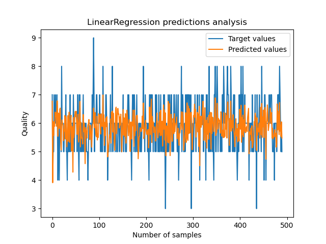
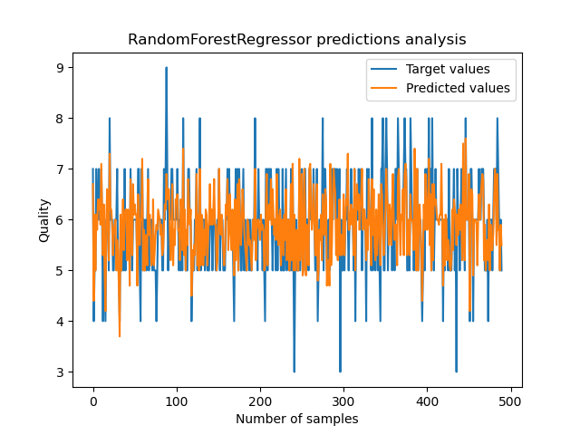

# Exercice AI supplémentaire (chapitre 9)

## Objectifs

L'exercice à compléter est un exemple simplifié d'un problème d'intelligence artificielle. Vous devrez implémenter vous-même l'exercice de bout en bout.

Vous disposez d'un ensemble de données (data/winequality-white.csv) qui contient plusieurs caractéristiques de vins dans le but d'en évaluer la qualité. Vous devez créer deux algorithmes d'intelligence artificielle qui prédiront la qualité d'un vin selon les caractéristiques contenues dans le fichier. Vous devez aussi évaluer vos deux algorithmes et afficher dans des graphiques séparés le résultat de la prédiction de la qualité du vin. Finalement, vous devez utiliser l'erreur moyenne absolue pour évaluer les deux modèles.

Pour vous guider dans la résolution de ce problème, voici les quelques étapes que vous devriez suivre:
    
1. Lire le fichier csv à l'aide de la librairie Pandas (https://pandas.pydata.org/docs/)

2. Séparer les attributs de l'ensemble de données (X) de la valeur cible (y). Dans l'ensemble de données fourni, l'attribut cible (y) est *quality*.

3. Séparer l'ensemble de données (X et y) en deux sous-ensembles. Le premier représentera l'ensemble d'entrainement (X_train, y_train) et le deuxième représentera l'ensemble de tests (X_test, y_test). Cette opération s'appelle: Train test split.

    **Hint**: Une méthode de la librarie scikit-learn permet de faire le train test split facilement.

4. Entrainer deux modèles d'intelligence artificielle sur votre ensemble d'entrainement (X_train, y_train). Le premier étant un modèle d'arbre de décision (Random Forest) et le deuxième une simple régression linéaire (Linear Regression). Utilisez la librairie scikit-learn.

    Pour Random Forest: https://scikit-learn.org/stable/modules/generated/sklearn.ensemble.RandomForestRegressor.html

    Pour Linear Regression: https://scikit-learn.org/stable/modules/generated/sklearn.linear_model.LinearRegression.html

5. Évaluer les deux modèles d'intelligence artificielle sur votre ensemble de tests (X_test). Vous devriez obtenir une liste représentant vos prédictions de la qualité du vin (quality).

6. Tracer pour chaque modèle, un graphique qui compare la prédiction faite au point précédent et la valeur réelle (y_test). Vous graphique devrait ressembler à ceci:

     

7. Évaluer l'erreur moyenne absolue (mean squared error) pour chaque modèle.

    **Hint** Une méthode de la librarie scikit-learn permet de faire le mse facilement.

