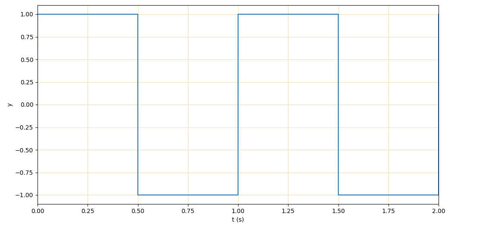

# Manipulation de signaux audio  (chapitre 10)

<!-- Avant de commencer. Consulter les instructions à suivre dans [instructions.md](instructions.md) -->

Nous allons reprendre l'exemple du chapitre 8 sur les fichiers WAV, mais en manipulant les signaux audio avec numpy plutôt qu'avec des listes et *struct*.

## Structure d'un fichier WAV (rappel des exercices ch. 8)

En audio numérique, la modulation d’impulsion codée (PCM en anglais) est une méthode utilisée pour représenter numériquement un signal analogique échantillonné. C’est ce qui est utilisé dans les ordinateurs, dans les CD audio et en téléphonie numérique. Dans un flux PCM, l’amplitude du signal analogique est enregistrée comme une valeur numérique à intervalles réguliers, c’est ce qu’on appelle l’échantillonnage. L’intervalle entre les échantillons est donné par la fréquence d’échantillonnage, qui est exprimée en Hz.

Un flux audio non compressé est donc composé d’une série d’échantillons de signal, et un fichier audio est typiquement composé d’un entête suivi d’un flux audio.

Dans la séance d'aujourd'hui, on utilise des fichiers WAVE dont le format des échantillons est un LPCM stéréo sur 16 bits à une fréquence de 44.1 kHz. Cela signifie que chaque échantillon contient en fait deux échantillons, un pour la gauche et un pour la droite, chacun allant de -32768 à 32767 (amplitude du signal) et qu’il y a 44 100 échantillons pour chaque seconde d’audio. C’est le format standard qui est utilisé dans les CD audio. Un fichier WAVE débute par un entête qui donne les caractéristiques du flux audio telles que la fréquence d’échantillonnage, le nombre de bit par échantillon, le nombre de canaux, etc.

On va se servir du module [wave](https://docs.python.org/3/library/wave.html) pour faire la lecture et l'écriture des fichiers WAV.

Pour avoir une introduction plus détaillée sur l’échantillonnage et sur les fichiers WAVE, vous pouvez consulter Wikipédia (ou suivre ce que le chargé dit pendant le cours) :

[Fichiers Wav](fr.wikipedia.org/wiki/WAVEform_audio_format)

[Échantillonnage PCM](fr.wikipedia.org/wiki/Modulation_d'impulsion_codée)

## Génération de signaux

### Sinusoïdal (`sine`)

Rappel : voici de quoi a l'air une onde sinusoïdale de 1Hz avec une amplitude de 1 (donc allant de -1 à 1):


Retournez un tableau Numpy de réels où chaque élément est un échantillon d'une onde sinusoïdale. On se rappelle de la formule de la valeur *y* d'une onde sinusoïdale à l'angle *x* en fonction de sa fréquence *F* et de son amplitude *A* :

<!-- y(x) = A \cdot \sin(F \cdot x) -->


Si on veut le *x* qui correspond à un moment *t* (en secondes), on peut dire que 2π représente une seconde, donc :

<!-- x(t) = 2 \pi t -->


Or, on a autant de valeurs de *t* qu'on a d'échantillons. Vous devez donc utiliser le taux d'échantillonage (constante `SAMPLING_FREQ` dans le code) pour calculer le nombre d'échantillons nécessaires pour une durée donnée.

Indices :
    [numpy.linspace](https://numpy.org/doc/stable/reference/generated/numpy.linspace.html),
    [numpy.sin](https://numpy.org/doc/stable/reference/generated/numpy.sin.html)

### Carré (`square`)

Rappel : voici de quoi a l'air une onde carrée de 1Hz avec une amplitude de 1 (donc allant de -1 à 1):



Retournez un tableau Numpy de réels représentant une onde carrée. Voici la formule d'une onde carrée :

<!-- y(t) = \textup{sgn}(\sin(F \cdot 2 \pi t)) -->


Où *t* est le temps en secondes (même concepts que dans la fonction précédente) , *sgn* représente la fonction de signe.

Indices :
    [numpy.sign](https://numpy.org/doc/stable/reference/generated/numpy.sign.html)

### Dents de scie (`sawtooth`)

Rappel : voici de quoi a l'air une onde en dents de scie de 1Hz avec une amplitude de 1 (donc allant de -1 à 1):


Retournez un tableau Numpy de réels représentant une onde en dent de scie. Voici la formule d'une telle onde :

<!-- y(t) = A \cdot 2 \left( t \cdot F - \left \lfloor \frac{1}{2} + t \cdot F \right \rfloor  \right) -->


Où *t* est le temps en secondes.

### Sinusoïdal avec harmoniques (`sine_with_overtones`)

En acoustique et en musique, une note est une onde composée d'une fréquence fondamentale et d'ondes dont la fréquence est un multiple entier de la fondamentale ([ses harmoniques](https://en.wikipedia.org/wiki/Harmonic_series_(music))).

Générez un signal sinusoïdal avec ses harmoniques qui sont passées en paramètre.

Par exemple, en faisant :

```python
sig = sine_with_overtones(440, 1, {2: 0.5, 3: 0.25, 4: 0.1}, 10)
```

On obtiendrait un signal dont la fondamentale est 440 Hz, et dont la première harmonique (ou *partielle* si on veut être pédantique) est 2 fois la fréquence fondamentale et moitié moins forte. La deuxième harmonique est trois fois la fondamentale et 25% aussi fort, etc.

## Manipulation de signaux

### Normalisation d'un signal (`normalize`)

Normalisez un signal à une certaine amplitude. Pour ce faire, il faut trouver l'échantillon le plus haut en valeur absolue, puis calculer le coefficient à appliquer pour ammener l'échantillon maximal à la cible de normalisation. On applique ensuite ce coefficient à tout le signal.

Indices:
    [numpy.absolute](https://numpy.org/doc/stable/reference/generated/numpy.absolute.html)

### Conversion en octets (`convert_to_bytes` et `convert_to_samples`)

Même chose que pour les exercices du chapitre 8, mais en utilisant les fonctionnalités de Numpy.

Indices:
    [numpy.round](https://numpy.org/doc/stable/reference/generated/numpy.round.html),
    [numpy.clip](https://numpy.org/doc/stable/reference/generated/numpy.clip.html),
    [numpy.ndarray.astype](https://docs.scipy.org/doc/numpy-1.15.0/reference/generated/numpy.ndarray.astype.html),
    [numpy.ndarray.tobytes](https://numpy.org/doc/stable/reference/generated/numpy.ndarray.tobytes.html),
    [Les dtype de Numpy](https://numpy.org/doc/stable/reference/arrays.dtypes.html#arrays-dtypes-constructing),
    [numpy.frombuffer](https://numpy.org/doc/stable/reference/generated/numpy.frombuffer.html)

## Analyse de signaux

### Transformée de Fourier (`apply_fft`)

Il est souvent très utile de visualiser et de traiter la densité des fréquences présentes dans un signal plutôt que le signal lui-même. Observons le graphique ci-dessous d'un accord joué au piano. Il faut faire une bonne quantité de calculs mentaux pour déterminer quelles notes ont été jouées pour produire ce signal.


La transformée de Fourier associe à tout signal une fonction dont la variable indépendante représente (dans notre cas) la fréquence. La variable dépendante est la magnitude (il en existe plusieurs noms), ou la densité de chacune des fréquences dans le signal.

Le graphique ci-dessous est la transformée de Fourier du signal précédant :


Une fois dans le domaine fréquentiel, on peut facilement identifier les fréquences qui composent le signal ainsi que leurs proportions. Dans ce cas, on observe les fréquences correspondantes à un accord parfait de La majeur.

Avec le module de FFT (Fast Fourier Transform) de SciPy, on s'épargne les mathématiques un peu lourde et on appelle `scipy.fft.fft` en lui passant notre signal. Ceci nous donne notre axe de magnitude (on peut le normaliser). Il faut aussi construire l'axe fréquentiel qui va avec. Il y a un exemple dans les notes de cours sur l'utilisation des FFT. Il faut faire attention à la longueur des axes.

Doc de SciPy : [scipy.fft.fft](https://docs.scipy.org/doc/scipy/reference/generated/scipy.fft.fft.html)

